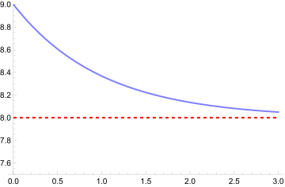

# Asymptote

2024/09/12

[Wolfram - FunctionRepository/resources/Asymptotes](//resources.wolframcloud.com/FunctionRepository/resources/Asymptotes/)

`Plot[{Exp[-x] + 8, 8}, {x, 0, 3}, PlotRange -> {7.5, 9}, PlotStyle -> {Lighter[Blue, 0.5], {{Red, Dashed, Thick}}}]`

